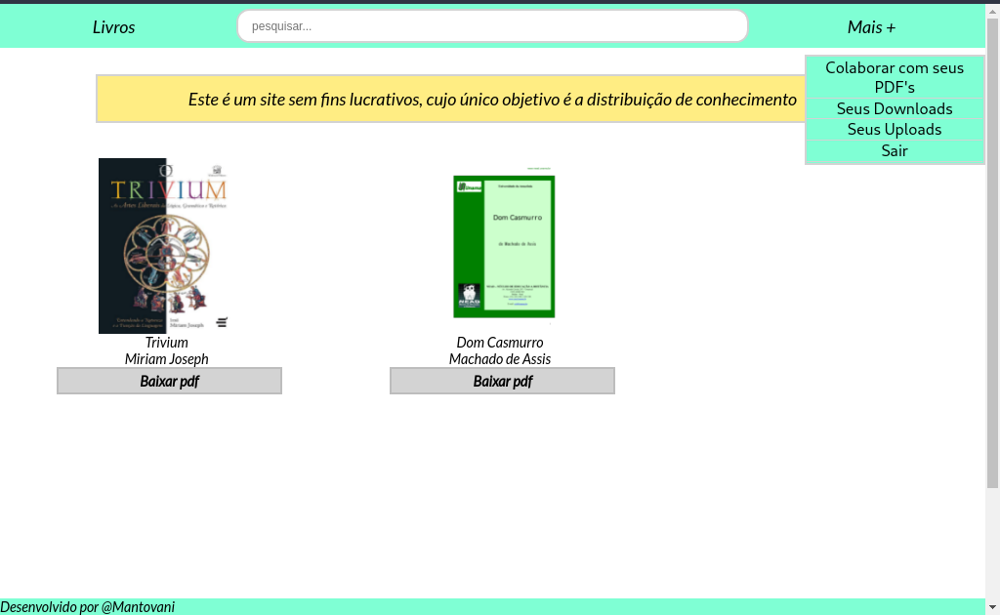

# online-library

Uma aplicação web em que você pode baixar ou fazer uploads de e-book's no formato pdf.

Aqui a tela inicial, onde aparece uma lista dos e-book's que foram publicados até o momento.

Você pode pesquisar por um e-book específico na barra de busca. A pesquisa é feita com base no título dos livros e no nome dos autores.

Aqui a tela onde é feito um cadastro de um pdf.

Quando você está logado em uma conta o seu histórico de downloads fica salvo em um arquivo .json. Ainda preciso implementar criptografia neste arquivo pois ele fica exposto no servidor (com os id's dos usuários e o nome do arquivo, não é uma informação que seria extremamente sensível mas mesmo assim é necessária uma melhor segurança) e além disso resta implementar um algoritmo de busca neste arquivo.

Esta é a tela onde são apresentados os uploads que o usuário realizou, estas informações são puxadas do banco de dados através da api express. 

Neste projeto foi usada React JS, Node JS (com os módulos jsonwebtoken para criação de tokens, sequelize para comunicação com o banco de dados MySQL, child-proccess para execução de scripts internos, multer para o envio de arquivos, e dotenv para gerenciamento das váriaveis de ambiente.

-Para extrair as capas dos pdf's eu optei por utilizar uma solução no linux (que foi onde eu fiz o projeto), e configurei um arquivo .sh para ser executado no servidor portanto este projeto precisa ser executado em uma máquina com linux. Este é o programa que você precisa instalar:   

*poppler-utils
