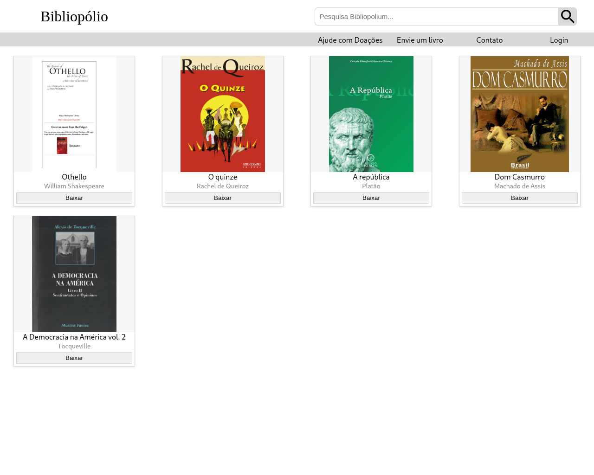
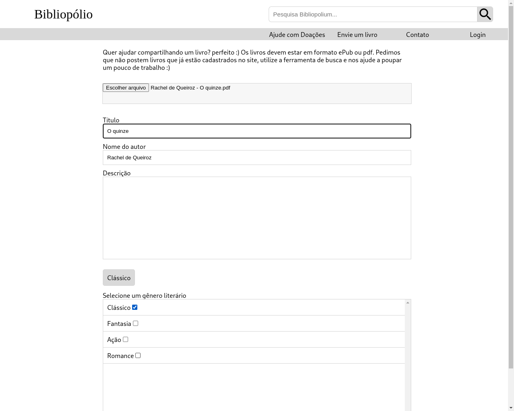

# bibliopolio

* esse app não está em ambiente de produção real, é apenas um projeto de portfólio.

Nesse website você pode consultar um acervo de livros em formato pdf ou ePub e também colaborar enviando seus arquivos para ele.
Aqui a paǵina inicial, onde aparece uma lista dos e-book's que foram publicados até o momento.

Página para colaboração

Página de contato

Para fazer upload dos arquivos utilizei um bucket S3 da AWS, caso você queira subir o projeto deve configurar o seu próprio bucket conforme a AWS orienta.
